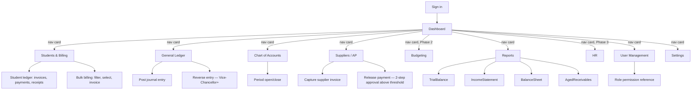
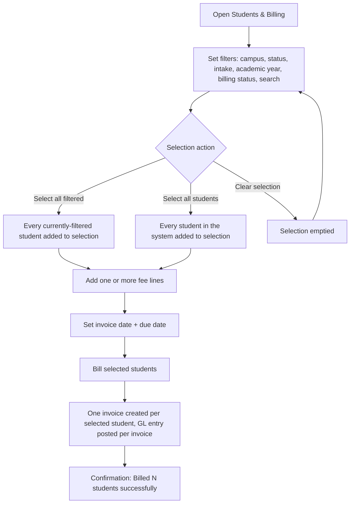

# Nova — Design System, Architecture & Roadmap

This is the design and planning deliverable for the Nova rebrand: brand
guide, information architecture, user flows, the RBAC permission matrix,
component library spec, and the detailed design for what Phase 2 and
Phase 3 will build. Phase 1 (everything with a ✅ below) is implemented
in this codebase today; Phase 2/3 are designed here so they can be built
without redesigning the data model or RBAC shape later.

## 1. Brand

**Name:** Nova. **Personality:** innovation, trust, academic excellence,
professionalism, simplicity, growth.

| Token | Hex | Use |
|---|---|---|
| Primary (Deep Academic Blue) | `#1E3A8A` | Sidebar, primary buttons, brand anchor |
| Secondary (Modern Blue) | `#2563EB` | Links, focus rings, hover states |
| Accent (Teal) | `#14B8A6` | The Nova spark mark, highlights |
| Success | `#22C55E` | Paid / posted / balanced states |
| Warning | `#F59E0B` | Open / partial / pending states |
| Danger | `#EF4444` | Void / reversed / overdue states |
| Background | `#F8FAFC` | Page background |
| Surface | `#FFFFFF` | Cards, panels, tables |
| Text | `#0F172A` | Body text |
| Muted text | `#64748B` | Labels, captions, secondary text |

Dark mode uses the same accent colors brightened slightly for contrast,
with surfaces/text/borders inverted — see `:root` / `html[data-theme="dark"]`
in `frontend/styles.css` for exact values.

**Typography:** Inter, one family throughout (weight carries hierarchy —
700/800 for headings, 600 for labels/buttons, 400 for body). No serif, no
monospace-for-numbers — a deliberate break from the previous "ledger paper"
visual system.

**Logo:** a rounded-square badge (primary→secondary gradient) containing a
four-point teal spark — see `frontend/favicon.svg` for the standalone mark,
and the `novaMark()` function in `frontend/api.js` for the inline version
used in the sidebar and login screen. Deliverable checklist:

- ✅ Icon mark (favicon.svg, also used inline)
- ✅ Wordmark lockup (mark + "Nova" text, in the sidebar crest and login card)
- ✅ Light-background and dark-background treatments (the mark's teal spark
  works on both the white login card and the navy sidebar; text color
  flips between `--text` and white depending on background)
- ⬜ Full brand guideline PDF, print collateral, letterhead template — not
  produced; this document's §1 is the working style guide in the meantime.

## 2. Information architecture



Sidebar navigation is role-filtered (see §4) — a role only sees links to
pages it can actually use. The dashboard's navigation cards are the primary
entry point; the sidebar is for lateral movement once inside a module,
and collapses to icon-only for more screen space (state persisted per
browser).

## 3. Key user flow: bulk billing



Selection persists across filter changes (it's a set of student IDs, not
"whatever's currently checked on screen") — so you can select everyone in
one campus, change the filter to check another campus, and add more to the
same batch before submitting.

## 4. RBAC permission matrix

Source of truth: `backend/src/rbac-policy.ts`. This table is generated by
hand from that file — if you change the code, update this table too.

| Permission | Admin | Vice-Chancellor | Accounts Officer | Bursar | Auditor | IT Admin | Budget Officer |
|---|:-:|:-:|:-:|:-:|:-:|:-:|:-:|
| View accounts | ✅ | ✅ | ✅ | ✅ | 🔒 | | |
| Edit chart of accounts | ✅ | ✅ | | | | | |
| View journal | ✅ | ✅ | ✅ | | 🔒 | | |
| Post journal entry | ✅ | ✅ | ✅ | | | | |
| Reverse journal entry | ✅ | ✅ | | | | | |
| Close/reopen period | ✅ | ✅ | | | | | |
| View/edit students | ✅ | ✅ | ✅ (view+edit) | ✅ (view+edit) | 🔒 (view) | | |
| Create invoice / bulk bill | ✅ | ✅ | ✅ | ✅ | | | |
| Record payment | ✅ | ✅ | ✅ | ✅ | | | |
| View/manage suppliers | ✅ | ✅ | ✅ | | 🔒 (view) | | |
| Create AP invoice | ✅ | ✅ | ✅ | | | | |
| Release AP payment | ✅ | ✅ | ✅ | | | | |
| View reports | ✅ | ✅ | ✅ | ✅ | 🔒 | | ✅ |
| View Management Accounts (KPIs + approvals) | ✅ | ✅ | | | | | |
| View audit log | ✅ | ✅ | | | 🔒 | ✅ | |
| View user directory | ✅ | ✅ | ✅ | ✅ | 🔒 | ✅ | ✅ |
| Manage users / grant auditor scopes | ✅ | | | | | ✅ | |
| Payroll import | ✅ | ✅ | | | | | |
| Create/submit budget | ✅ | | | | | | ✅ |
| Review budget | ✅ | ✅ | | | | | |
| Approve budget | ✅ | ✅ | | | | | |

🔒 = the role permission is a **ceiling**, not an automatic grant — for the
`auditor` role specifically, an administrator must also grant the matching
data scope per account (see §4.1) before this actually works for a given
auditor. Every other role's ✅ is unconditional.

**Note on `finance_clerk` → `accounts_officer`:** the Nova rebrand renamed
this role to match the spec's terminology. It's the same permission set as
before — day-to-day transaction processing without reversal/close/payroll
authority — just a clearer name. `it_admin` isn't in the spec's named role
list but is kept because someone needs to manage accounts without touching
financial data.

**Note on `finance_manager` + `principal` → `vice_chancellor`:** these two
roles have been consolidated into one. Principal's old permission set
(`report:view`, `student:read`, `user:read`, `budget:approve`,
`management:view`) was already a strict subset of Finance Manager's, so
the merged role is simply Finance Manager's original permission list —
nothing was lost, and budget review + approval are now both a
Vice-Chancellor action rather than split across two people. Separation of
duties still holds one level up: Budget Officer creates/submits, the
Vice-Chancellor reviews and approves.

### 4.1 Auditor data scopes

Unlike every other role, `auditor`'s row in the table above is a
**ceiling**, not a grant. The actual gate is a `dataScopes` array stored on
the individual `User` record (`accounts`, `journal`, `students`, `billing`,
`suppliers`, `reports`, `audit`, `users`), checked live on every request in
`backend/src/middleware/rbac.ts`'s `require()` — not cached in the JWT, so
a scope an admin revokes stops working on that auditor's very next request,
no re-login required. Managed via `PUT /api/users/:id/data-scopes`
(`user:manage` — admin or IT admin) or the "Manage access" panel on
**User Management**. New auditor accounts start with no scopes granted —
access is opt-in, not opt-out.

## 5. Component library spec

All components live in `frontend/styles.css`, one shared stylesheet, no
per-component files (there's no build step to bundle them). Reference:

| Component | Class(es) | Notes |
|---|---|---|
| Button (primary/secondary/danger/accent) | `button`, `.secondary`, `.danger`, `.accent`, `.small` | Primary buttons use `--primary` bg; secondary is outline-style |
| Form field | `.field`, `label`, `input`/`select`/`textarea` | Label always above the control, 600-weight, muted color |
| Data table | `.ledger` | Header row uppercase/muted, hover-highlight rows, `.num` for right-aligned monetary columns |
| Panel/card (content) | `.panel` | White surface, 14px radius, subtle shadow |
| Navigation card (dashboard) | `.nav-card`, `.disabled`, `.soon` | Large clickable tile with icon, title, description; disabled state for unbuilt modules |
| Status badge | `.pill`, `.pill-paid`/`.pill-open`/`.pill-void`/etc. | Semantic color via success/warning/danger washes |
| Alert/banner | `.alert-error`, `.alert-ok` | Inline, dismissing automatically for non-error kinds |
| Tabs | `.tabs button.active` | Underline-style, used in Reports |
| Sidebar nav | `.rail`, `.rail-collapsed` | Collapsible, icon+label, active-state highlight |
| Notification bell | `.notif-bell`, `.notif-badge`, `.notif-panel` | Auto-injected into any page's `.letterhead` by `mountHeaderExtras()` in api.js |
| Theme toggle | `.theme-toggle` | Two-state light/dark switch, persisted to localStorage |
| Modal/dialog | *(not yet built)* | No page currently needs a true modal — confirmations use `confirm()`. Add `.modal-backdrop`/`.modal` if a future feature needs one. |
| Tooltip | *(not yet built)* | Same — nothing currently needs hover-detail beyond `title` attributes. |
| Activity timeline | *(not yet built)* | The audit log's expandable before/after rows serve this purpose today; a true vertical timeline component would be a Phase 2/3 nicety, not a functional gap. |

Icons are inline SVG strings (`ICON_PATHS` in `api.js`), not an icon font
or external library — keeps the app dependency-free and consistent with
the "no build step" architecture.

## 6. Phase 2 design (not yet built — this is the spec to build against)

### 6.1 Budget management module ✅ Built

Implemented as designed below — `backend/src/services/budget.ts`, `backend/src/routes/budgets.ts`, `frontend/budgeting.html`. One difference from the original sketch: `lockBudget`/`approveBudget` share the `budget:approve` permission rather than a separate `budget:lock`, since locking is just finalizing an already-approved budget.

**Data model** (extends `docs/schema.sql` when migrated to Postgres; for
now, extends `backend/src/types.ts` the same way every other entity does):

```ts
interface Budget {
  id: string;
  refNo: string;            // "BUD-2027-0001"
  name: string;              // "FY2027 Academic Department Budget"
  costCenterId: string | null;
  accountId: string;         // which GL account this budget line tracks
  periodId: string;          // which period it covers
  amount: number;             // cents
  status: "draft" | "submitted" | "reviewed" | "approved" | "locked";
  createdBy: string;
  submittedAt: string | null;
  reviewedBy: string | null;
  approvedBy: string | null;
  lockedAt: string | null;
  revisionOf: string | null;  // points to the prior version if this is a revision
}
```

**Workflow:** `draft → submitted → reviewed → approved → locked`, each
transition its own endpoint (`POST /api/budgets/:id/submit`, `/review`,
`/approve`, `/lock`), each one an audited action via the existing
`writeAudit()` — no new audit infrastructure needed. RBAC: `budget:create`/
`budget:submit` (Budget Officer), `budget:review` (Vice-Chancellor),
`budget:approve` (Vice-Chancellor) — all four permissions
already declared in `rbac-policy.ts` today, unused until this module lands.

**Report:** Budget vs. Actual — for each budget line, sum posted GL activity
against `accountId` within `periodId` (reusing the existing `trialBalance()`
service's account-summing logic) and show variance.

### 6.2 Period-end closing tools ✅ Built (month-end + year-end; bank reconciliation below is still Phase 2c)

Implemented as designed — `backend/src/services/periodClose.ts`, wired into `backend/src/routes/periods.ts` and the periods panel in `frontend/accounts.html`. The month-end checklist ended up with 4 concrete checks (trial balance balanced, earlier periods closed, no AP payments pending approval, period actually ended) rather than a generic "unposted transactions" check, since this system has no draft/unposted state to check for — everything posts immediately.

**Month-end:** a checklist endpoint (`GET /api/periods/:id/close-checklist`)
that runs existing checks — trial balance balanced? any draft/unposted
transactions? — and returns pass/fail per item. The period `close` action
already exists; this adds a pre-flight check in front of it.

**Year-end:** a `POST /api/periods/:id/year-end-close` action that posts a
single closing journal entry zeroing every income/expense account into
Retained Earnings (already a seeded equity account, ready for this) and
carries forward asset/liability/equity balances into the next period. This
is a natural extension of `postJournalEntry()` — no new posting mechanism
needed, just a service function that computes the closing entry's lines
from `trialBalance()`.

### 6.3 Bank reconciliation

**Data model:**
```ts
interface BankStatementLine {
  id: string;
  bankAccountId: string;    // an Account with isControlAccount: "BANK"
  date: string;
  description: string;
  amount: number;            // cents, signed
  matchedJournalLineId: string | null;
  status: "unmatched" | "matched" | "ignored";
}
```
**Import:** `POST /api/bank/import` accepts a CSV/OFX file, parses into
`BankStatementLine[]`. **Auto-match:** for each unmatched line, look for a
posted journal line on the same BANK control account with the same amount
within a small date window — flag as a suggested match, require human
confirmation (`POST /api/bank/lines/:id/match`) rather than auto-committing,
per the original system's "fail-safe reconciliation" principle. **Report:**
`GET /api/bank/reconciliation?bankAccountId=` — matched total vs. GL
balance vs. outstanding items.

## 7. Phase 3 (roadmap only — no detailed design yet)

- **Full Excel import framework**: template download per entity type,
  column validation, preview-before-commit, duplicate detection. The
  `xlsx` library already in use for export handles parsing too (`XLSX.read`),
  so this is additive, not a new dependency.
- **MFA**: TOTP-based, `user.mfaSecret` field already reserved in
  `docs/schema.sql`.
- **Deep multi-campus hierarchy**: splitting `Student.program` (currently
  a free-text field) into normalized Campus → Faculty → Department →
  Program → Course entities, each with their own CRUD and used as the
  bulk-billing filter dimensions instead of free-text matching.

## 8. Migration strategy (upgrading an existing installation to Nova)

Since Nova is this same system evolving in place (not a separate product
migrating data from elsewhere), "migration" means upgrading an existing
deployment's data to the new shape:

1. **Back up first**: copy `backend/data.json` (or, once on Postgres, run
   `pg_dump`) before upgrading.
2. **Role rename**: any user with `role: "finance_clerk"` in stored data
   needs to become `"accounts_officer"` — a one-line data migration
   (`UPDATE users SET role = 'accounts_officer' WHERE role = 'finance_clerk'`
   once on Postgres; for the current JSON store, a small one-off script
   using the same `Store` class would do it).
3. **New required fields**: `Student.status` is now required — existing
   student records need a default (`"active"`) backfilled. `campus`,
   `intake`, `academicYear` are optional and can stay blank.
4. **Audit log**: existing entries won't have `ipAddress`/`module` — both
   are optional-safe to read (`ipAddress` can be `null`, `module` can be
   derived retroactively from `entityType` using the same
   `deriveModule()` logic in `middleware/audit.ts`, so a one-time backfill
   script is straightforward if wanted).
5. **No breaking API changes**: every existing endpoint's response shape
   was extended, not changed — old frontend code reading `students.students`
   or `journal.journalEntries` keeps working; new fields (`refNo`, `status`,
   `ipAddress`, pagination metadata) are additive.

## 9. Implementation roadmap summary

| Phase | Scope | Status |
|---|---|---|
| 1 | Rebrand, design system, dashboard redesign, bulk billing filters, modernized chart of accounts, 8-role RBAC, audit IP/module, dark mode, notifications, xlsx export | ✅ Built, tested |
| 2a | Budget management module (create/submit/review/approve/lock/reject, Budget vs. Actual) | ✅ Built, tested |
| 2b | Period-end closing (checklist + year-end closing entry) | ✅ Built, tested |
| 2c | Bank reconciliation | Designed (§6.3), not built |
| 3 | Full Excel import framework, MFA, deep multi-campus hierarchy | Roadmap only (§7) |
